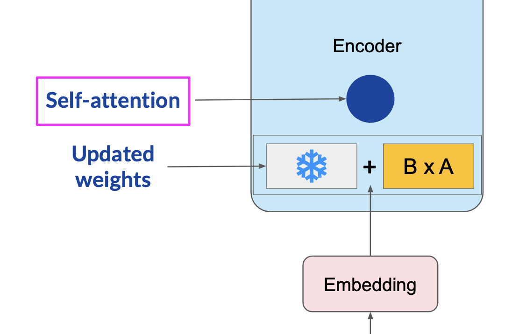
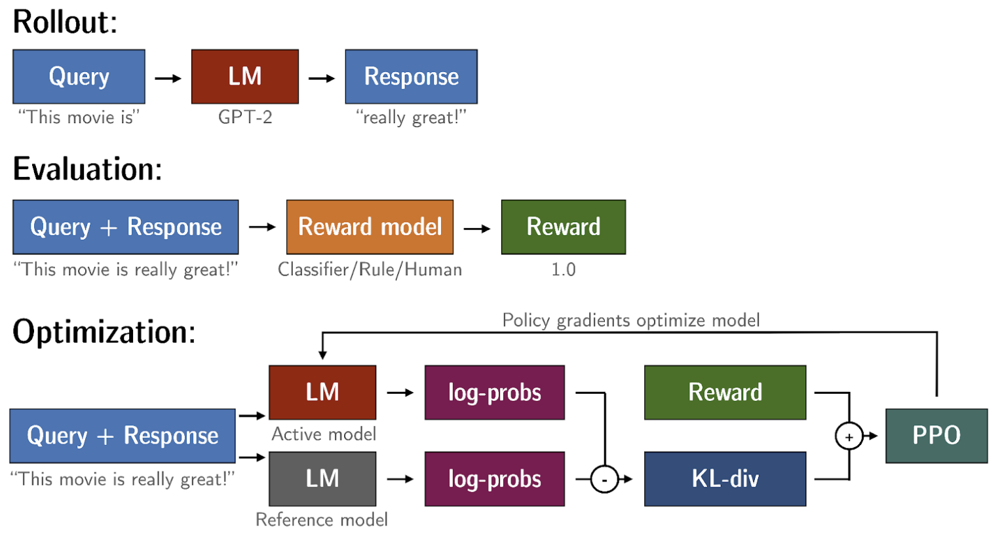

## Low Rank Adaptation Representation Reparamatization and Reinforcement Learning with Human Feedback

The Low-Rank Adaptation of Large Models (LoRA)[1](#Reference) is a parameter efficient fine-tuning method 
as it freezes the original LLM parameters, injects a pair of low rank decomposition matrices. The dimensions of the matrices
are set so that their product is the same dimensions of the original LLM. This smaller matrices is updated during 
training. During Inference, the low rank matrices are multiplied and added to the original LLM weights. 

LoRA process

In the project, I used the LoRA method to fine tune the FLAN-T5 model[2](#Reference) for dialouge 
summarization. Using the DialogSum dataset, the fine-tuned model achieved improvement in all the ROUGE score metrics 
category.

|   Metric   | Percentage Improvement |
|:-----------:|:-----------------------:|
|   Rouge1    |          17.5%          |
|   Rouge2    |           8.7%          |
|   RougeL    |          12.4%          |
| RougeLsum |          12.3%          |

Utilizing the transformers TRL library, I fine-tuned the model to detoxify summaries. Using the Proximal Policy
Optimization[4](#Reference), in addition with KL-Divergence to ensure the updated policy does not deviate
far from the original policy. I made use of META's AI RoBERTa based hate speech model[5](#Reference). 

RL process

The RL-finetuned model achieved a 54% average increment in non-toxic score over the baseline/peft model.

## Reference
1. [LoRA: Low-Rank Adaptation of Large Language Models](https://arxiv.org/abs/2106.09685), J. Hu *et al*.
2. [google/flan-t5-base from 🤗](https://huggingface.co/google/flan-t5-base)
3. [Transformers Reinforcement Learning](https://huggingface.co/docs/trl/en/index)
4. [Proximal Policy Optimizations Algorithms](https://arxiv.org/abs/1707.06347), Schulman *et al*
5. [facebook/roberta-hate-speech from 🤗](https://huggingface.co/facebook/roberta-hate-speech-dynabench-r4-target)
6. [Generative AI with LLMs](https://www.deeplearning.ai/courses/generative-ai-with-llms/)